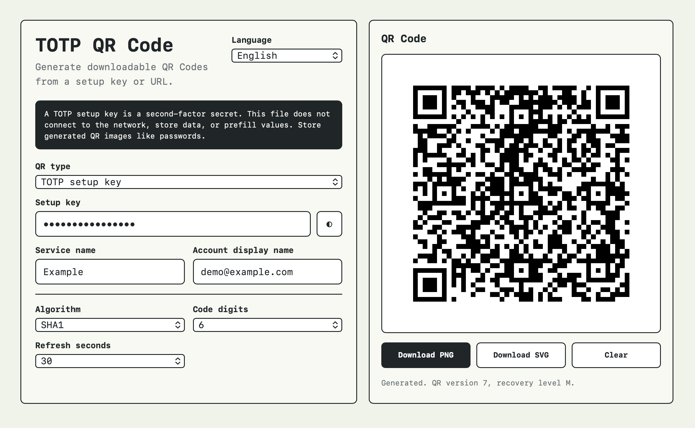

# Offline QR Tool

A single-file offline QR Code tool.

Current features:

- Generate QR Codes from TOTP setup keys for authenticator apps.
- Generate QR Codes from regular URLs.
- Download as PNG or SVG.
- Switch UI language: Traditional Chinese, English, Japanese.

Also known as:
- TOTP QR Code generator
- OTPAuth URI generator
- Google Authenticator setup key QR generator
- 2FA secret QR generator

## Why Offline

TOTP setup keys are second-factor secrets. Anyone with the setup key or generated authenticator QR Code can generate your 2FA codes.

This tool is designed to be downloaded and opened locally:

- No external scripts.
- No network requests.
- No browser storage.
- No preset account data.

For real TOTP setup keys, download `index.html`, disconnect from the network if desired, and open the file locally in your browser.

## Use

1. Download `index.html`.
2. Open it in your browser.
3. Choose the QR type:
   - TOTP setup key
   - Regular URL
4. Enter the relevant content.
5. Download the generated QR Code as PNG or SVG.

For TOTP, keep the defaults unless your service explicitly says otherwise:

- Algorithm: `SHA1`
- Digits: `6`
- Period: `30`

## Safety Notes

- Do not paste real TOTP setup keys into online QR generators.
- Do not post real setup keys, recovery codes, generated TOTP QR Codes, or screenshots containing them in issues or discussions.
- Store generated TOTP QR files like passwords or recovery codes.
- After scanning a TOTP QR Code into an authenticator app, test it by signing in to the original service.

## Roadmap Ideas

- More QR payload types.
- Import/export helpers for local backup workflows.
- Optional printable backup sheet.
- Additional offline validation checks.

## License

MIT
